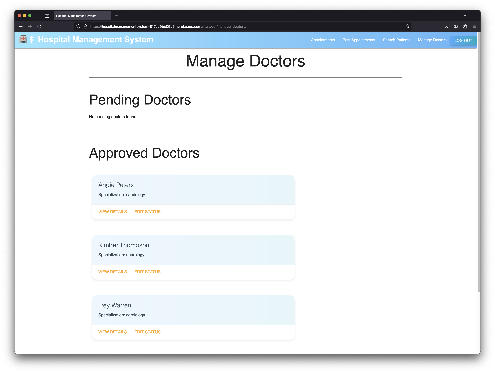
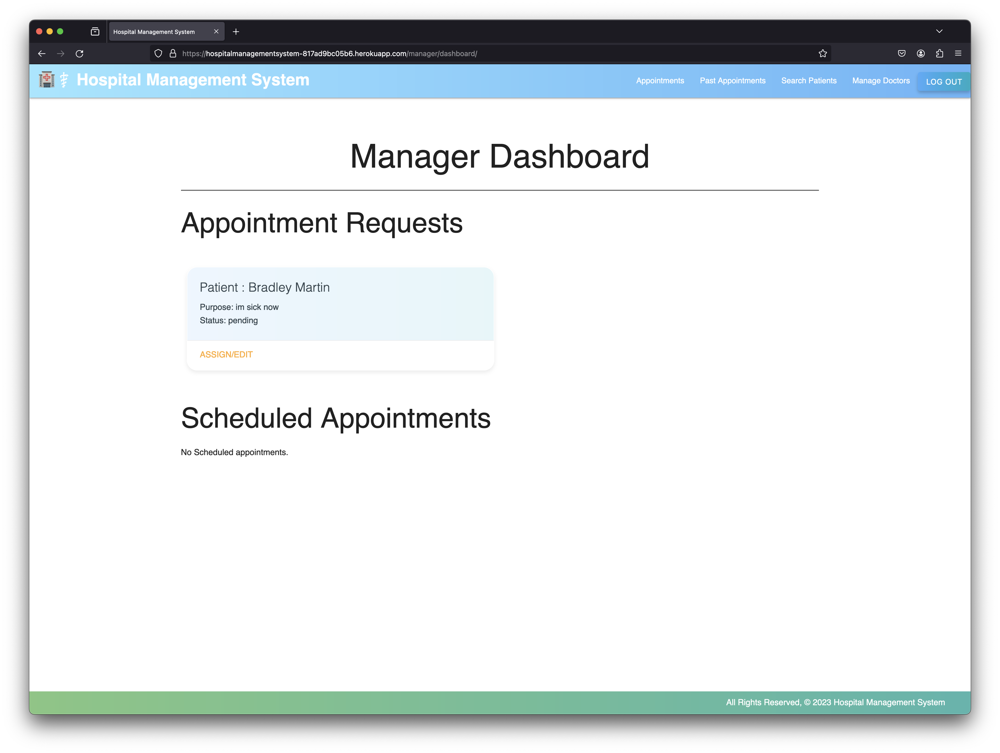
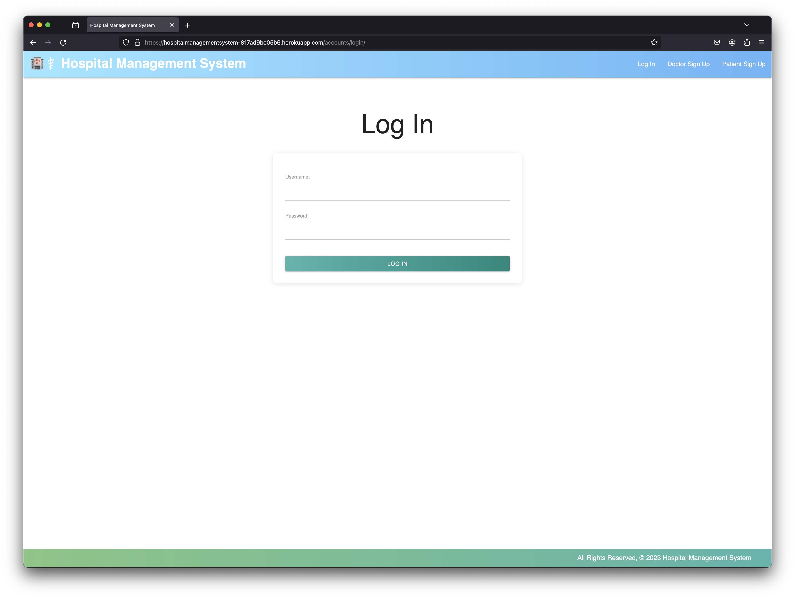

# Hospital Management System

This application is designed to streamline the operations of a hospital by providing an integrated platform for managing patient information, appointments, medical records, and administrative tasks.

https://hospitalmanagementsystem-817ad9bc05b6.herokuapp.com/

Existing Manager Account: 
- Username - WanAqim
- Password - 1234

## Description

The Hospital Management System (HMS) is a comprehensive and integrated software designed to manage all the aspects of a hospital operation, such as medical, administrative, and the corresponding service processing.

## Features

### For Patients
- Securely view and edit personal health profiles.
- Schedule and manage appointments with ease.
- Access comprehensive medical records and history provided by healthcare professionals.

### For Hospital Management
- Monitor and optimize hospital administrative operations.
- Review, assign, and manage patient appointment requests.
- Streamline the approval process for doctor's accounts.
- Implement advanced patient search capabilities to enhance patient management.

### For Doctors
- Access a centralized database of patient medical records.
- Manage daily appointments and patient flow efficiently.
- Utilize digital prescription tools to prescribe and manage medications.
- Track and review treatment history of patients under their care.

## Screenhots

## Instruction

### Manager Account Creation
- Create a Django built-in admin account via the Heroku terminal `heroku run python3 manage.py createsuperuser`.
- Log in to the superuser account and create an additional account for managers (create a user and change the user role to 'Manager').
- Existing Manager Account: 
- Username - WanAqim
- Password - 1234

### Doctor Account Creation
- Create an account via the Doctor Signup on the landing page.
- To log in, the account needs to be approved by the manager under the 'Manage Doctors' section.
- Once the account status changes to 'Valid' from 'Pending', doctors will be able to log in to their accounts.
- Managers have the feature to block a doctor's account from logging in by changing the account status from 'Valid' or 'Pending' to 'Rejected'.

### Patient Account Creation
- Create an account via the Patient Signup on the landing page.
- To log in, simply log into the account the patient just created.
- Successful account creation from the signup page will automatically log the patient into their account.

### Creating an Appointment (Patient)
- To request an appointment, on the main dashboard page, type down the purpose of the appointment in the form and click submit.
- The appointment request will be reviewed by managers.
- Managers will assign a Doctor, time, and date to the appointment based on the patient's current illness.

### Assigning Doctor, Time, and Date to an Appointment (Manager)
- To assign a Doctor, time, and date to an appointment request, go to the Manager's main page and view the current pending appointment requests.
- Edit the appointment by clicking the Assign/Edit button on the appointment card.
- In the appointment edit view, the manager will be given a list of doctors, dates, times, and statuses to choose from.
- Assign a Doctor to the appointment. The manager will have to approve a doctor from the 'Manage Doctors' section for the doctor to appear in the list.
- After assigning a Doctor, date, and time, change the appointment status to 'Scheduled'.

### Updating Appointment Status and Submitting Medical Records (Doctor)
- In the Doctor Dashboard, doctors can see appointments scheduled for them by the managers.
- To update an appointment status, click on the 'Change Appointment Status' button on the appointment card.
- Change the appointment status from 'Scheduled' to 'Completed'.
- To submit medical records for a completed appointment, go to the 'Completed Appointments' section, view the appointment, and submit the medical records.
- Enter Diagnosis, Treatment, and Prescriptions for the patient and click submit.
- Once submitted, the doctor will be redirected to the appointment detail page, which now includes the medical records for that particular appointment.
- Doctors can also edit the medical records if necessary.

### Checking Patients (Doctor)
- After completing an appointment, doctors can see the patients they have treated in the 'My Patients' section.
- Patients are displayed in card format, and doctors can view their details and past appointments.

### Viewing Medical Records (Patient)
- To view medical records after a doctor has submitted them, patients can go to the 'Medical Records' section in their dashboard.

## Technologies Used

### Software Used:
- Microsoft VS Code : Version 1.85.1
- Github
- Google Chrome : Version 119.0.6045.159

### Backend Software
- Django
- PostgreSQL
- Django Authentication

### Security
- Django Authentication
- Django Password Hashing

### Language Used:
- Python : Version 3.11.6
- CSS3 : Version W3 CSS 4.15
- HTML : Version 5

### Operating System:
- macOS : Sonoma 14.1.2

## Other
This Project was created under course "Software Engineering Immersive" presented by student of General Assembly Australia